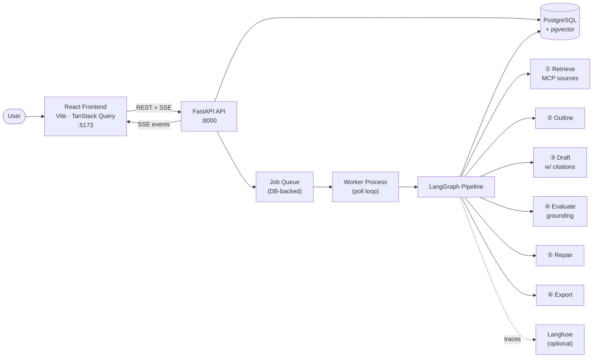

# ResearchOps Studio

AI-powered research pipeline with automated grounding evaluation.

## What it does

ResearchOps Studio takes a research question, retrieves academic sources from multiple databases (OpenAlex, arXiv, Europe PMC) via MCP connectors, drafts a structured report with inline citations, then runs an automated grounding evaluation — scoring each section for faithfulness to the source pack and flagging unsupported or contradicted claims.

## Architecture



## What it produces

After a run completes the evaluation tab shows grounding metrics for every report section:

```json
{
  "grounding_pct": 91,
  "faithfulness_pct": 88,
  "sections_passed": 9,
  "sections_total": 11,
  "issues_by_type": {
    "missing_citation": 3,
    "unsupported": 2
  }
}
```

`grounding_pct` is the share of sections that pass citation verification. `faithfulness_pct` measures claim-to-source alignment. `issues_by_type` enumerates detected problems by category so you can see at a glance where the draft needs attention.

## Quickstart

**Prerequisites:** Python 3.11, Node 20, PostgreSQL 16 with the `pgvector` extension.

```bash
# 1. Clone and configure the root `.env`
cp .env.example .env
# Edit only non-secret values in `.env`.
# Leave secret values blank and provide them via Doppler.

# 2. Python dependencies
pip install torch --index-url https://download.pytorch.org/whl/cpu
pip install -r requirements.prod.txt -r requirements.dev.txt

# 3. Connect the repo to Doppler and add the secret values there
doppler setup

# 4. Database
alembic upgrade head          # run from backend/

# 5. Start the full local stack
doppler run -- python scripts/dev.py
```

Open [http://localhost:5173](http://localhost:5173).

## Docker With Doppler

The base Docker Compose file reads the root `.env` for non-secret local configuration and expects secrets from the current process environment. Run Compose through Doppler so container secrets come from Doppler while `.env` continues to supply safe local defaults.

```bash
# 1. Install Doppler CLI and link this repo to a Doppler project/config
doppler setup

# 2. Start the stack with secrets injected at runtime
cd backend
doppler run -- docker compose -f deployment/compose.yaml up --build
```

You can also use:

```bash
cd backend
make up-doppler
```

`api` and `worker` still read the root `.env` for non-secrets, but secret variables such as API keys and signing secrets are taken from the shell, so Doppler-provided values win.

## Configuration Split

Use the root `.env` for non-secret local configuration only. Use Doppler or deployment environment variables for secrets.

**Root `.env` non-secret examples:**

| Variable | Description |
|---|---|
| `DATABASE_URL` | Local PostgreSQL connection string for non-Docker runs |
| `CORS_ALLOW_ORIGINS` | Browser origins allowed by the API |
| `VITE_API_BASE_URL` | Frontend API base URL; `/api` works with the Vite proxy |
| `LOG_LEVEL` | Local logging verbosity |
| `LLM_PROVIDER` | Provider selection such as `hosted` or `bedrock` |

**Secrets to provide via Doppler or deployment env:**

| Variable | Description |
|---|---|
| `HOSTED_LLM_API_KEY` | API key for the hosted LLM endpoint |
| `TAVILY_API_KEY` | Tavily search API key (web search in chat) |
| `AUTH_JWT_SECRET` | Signing secret for access tokens |
| `AUTH_REFRESH_TOKEN_SECRET` | Secret used for refresh tokens |
| `AUTH_PASSWORD_RESET_SECRET` | Secret used for password reset tokens |
| `AWS_SECRET_ACCESS_KEY` | AWS secret for Bedrock-backed providers |
| `SMTP_PASSWORD` | SMTP password for outbound email |

## Tech stack

| Layer | Technology |
|---|---|
| API | FastAPI, SQLAlchemy (async), asyncpg |
| Pipeline | LangGraph, httpx |
| Storage | PostgreSQL, pgvector |
| Frontend | React 18, Vite, TanStack Query |
| Observability | Structured JSON logs, Langfuse (optional) |

